# 🔥 the-Photatos — 자율 소화 로봇 시스템

> **부실한 감자들의 노력**  
> STM32F411 기반 적외선 화염 감지 · 칼만 필터 추정 · 자동 소화 로봇

---

## 📋 목차

- [프로젝트 개요](#-프로젝트-개요)
- [시스템 아키텍처](#-시스템-아키텍처)
- [하드웨어 구성](#-하드웨어-구성)
- [핀 배치표](#-핀-배치표)
- [소프트웨어 구조](#-소프트웨어-구조)
- [시스템 초기화 흐름](#-시스템-초기화-흐름)
- [타이머 아키텍처](#-타이머-아키텍처)
- [화염 감지 알고리즘](#-화염-감지-알고리즘)
- [칼만 필터](#-칼만-필터)
- [화염 벡터 추정](#-화염-벡터-추정)
- [제어 시스템](#-제어-시스템)
- [상태 머신](#-상태-머신)
- [UART DMA 전송 시스템](#-uart-dma-전송-시스템)
- [실시간 모니터링 도구](#-실시간-모니터링-도구)
- [빌드 및 플래싱](#-빌드-및-플래싱)
- [프로젝트 구조](#-프로젝트-구조)
- [시리얼 출력 포맷](#-시리얼-출력-포맷)
- [메인 루프 흐름](#-메인-루프-흐름)
- [라이선스](#-라이선스)

---

## 🎯 프로젝트 개요

**the-Photatos**는 4채널 적외선(IR) 화염 센서 어레이를 사용하여 화염의 방향과 강도를 실시간으로 감지하고, **적응형 칼만 필터(Adaptive Kalman Filter)** 로 센서 노이즈를 제거한 뒤, 스테퍼 모터(수평 Pan)와 서보 모터(수직 Tilt)로 노즐을 정밀 조준하여 자동으로 워터 펌프를 가동하는 **자율 소화 로봇 시스템**입니다.

### 핵심 기능

| 기능 | 설명 |
|------|------|
| **화염 감지** | 4채널 IR 센서 어레이 (90° 간격 원형 배치), DMA2 기반 Circular ADC 샘플링 |
| **칼만 필터** | 4-state 적응형 칼만 필터 — Adaptive R, 동적 B 행렬, Gauss-Jordan 역행렬 |
| **방향 추정** | 칼만 필터 출력 → 유클리드 정규화 → 방향 단위 벡터 투영 → `FireVector_t {x, y, intensity}` |
| **자동 조준** | TIM5 ISR (50ms) — EMA 평활화 + 스테퍼(Pan) / 서보(Tilt) 비례 제어 |
| **자동 소화** | 조준 안정화 1초 후 워터 펌프 자동 ON, 화염 소멸 시 1초 후 자동 OFF |
| **상태 표시** | LED(초록/빨강) + 부저로 안전/화재 상태 표시 (히스테리시스 적용) |
| **DMA 시리얼** | UART2 DMA TX (230400 baud) — 링 버퍼 2048B, 논블로킹 printf |
| **실시간 모니터링** | Python matplotlib 실시간 대시보드 + GIF 녹화 기능 |

---

## 🏗 시스템 아키텍처

### 전체 시스템 블록도

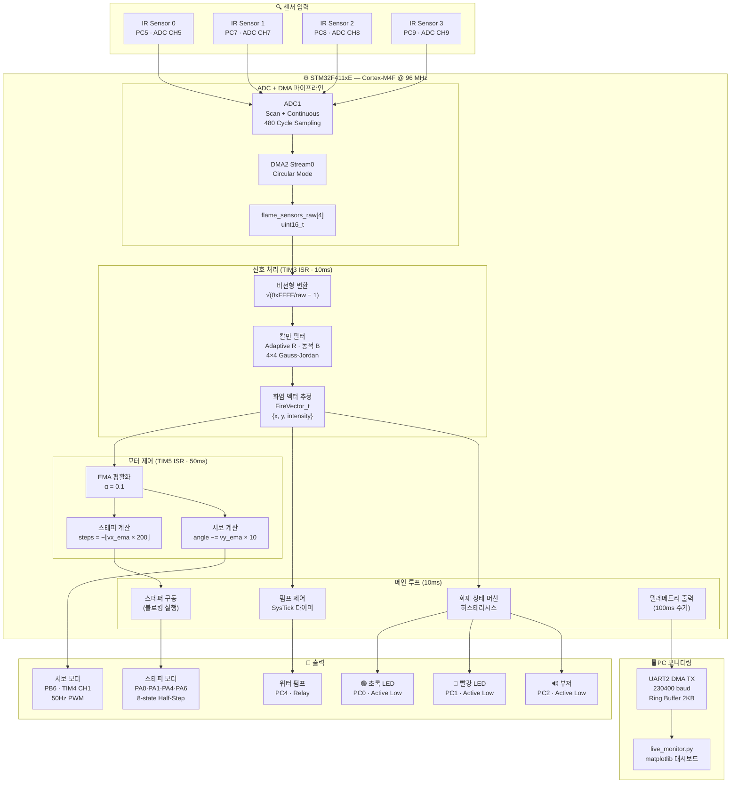

### 인터럽트 우선순위 계층도

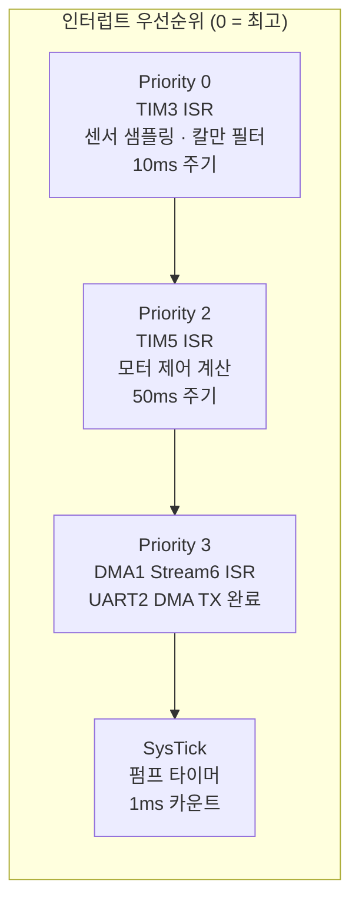

---

## 🔧 하드웨어 구성

### MCU 사양

| 항목 | 사양 | 설정 코드 |
|------|------|-----------|
| **MCU** | STM32F411xE (ARM Cortex-M4F) | `crt0.s` |
| **시스템 클럭** | 96 MHz (HSI → PLL: M=8, N=192, P=4) | `clock.c` |
| **Flash** | 512 KB (0x08000000 ~ 0x0807FFFF) | `rom_0x08000000.lds` |
| **RAM** | 128 KB (0x20000000 ~ 0x2001FFFF) | `option.h` |
| **FPU** | 단정밀도 FPv4-SP-D16 (CP10, CP11 Full Access) | `main.c`, `flame.c` |
| **APB1 버스** | 48 MHz (PCLK1 = HCLK/2) | `option.h` |
| **APB2 버스** | 96 MHz (PCLK2 = HCLK) | `option.h` |
| **TIMXCLK** | 96 MHz (PCLK1≠HCLK이므로 PCLK1×2) | `option.h` |
| **Heap** | 16 KB (HEAP_BASE ~ HEAP_LIMIT) | `option.h` |

### PLL 클럭 구성

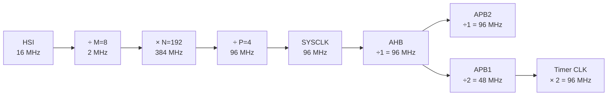

### 주변 장치

| 장치 | 수량 | 용도 | 인터페이스 |
|------|------|------|-----------|
| **IR 화염 센서** | 4개 | 화염 방향·강도 감지 | ADC1 CH5, CH7, CH8, CH9 (DMA Circular) |
| **스테퍼 모터** | 1개 | 수평 회전 (Pan) | GPIO 4핀 (PA0, PA1, PA4, PA6) |
| **서보 모터** | 1개 | 수직 틸트 (Tilt) | TIM4 CH1 PWM (PB6) |
| **워터 펌프** | 1개 | 물 분사 (릴레이 제어) | GPIO (PC4) |
| **LED (초록)** | 1개 | 안전 상태 표시 | GPIO Active Low (PC0) |
| **LED (빨강)** | 1개 | 화재 상태 표시 | GPIO Active Low (PC1) |
| **부저** | 1개 | 화재 경보 | GPIO Active Low (PC2) |
| **사용자 버튼** | 1개 | 입력 (EXTI) | GPIO Input (PC13) |

---

## 📌 핀 배치표

### GPIOA

| 핀 | 기능 | AF/Mode | 설명 |
|----|------|---------|------|
| PA0 | GPIO Output | Push-Pull | 스테퍼 모터 Phase A |
| PA1 | GPIO Output | Push-Pull | 스테퍼 모터 Phase B |
| PA2 | AF07 (USART2 TX) | Alternate | 시리얼 텔레메트리 출력 (DMA TX) |
| PA3 | AF07 (USART2 RX) | Alternate | 시리얼 입력 |
| PA4 | GPIO Output | Push-Pull | 스테퍼 모터 Phase C |
| PA6 | GPIO Output | Push-Pull | 스테퍼 모터 Phase D |
| PA8 | GPIO Output | Push-Pull | SPI1 nCS (SC16IS752) |
| PA9 | AF07 (USART1 TX) | Alternate | UART1 (보조) |
| PA10 | AF07 (USART1 RX) | Alternate | UART1 (보조) |

### GPIOB

| 핀 | 기능 | AF/Mode | 설명 |
|----|------|---------|------|
| PB3 | AF05 (SPI1 SCK) | Alternate | SPI1 클럭 |
| PB4 | AF05 (SPI1 MISO) | Alternate | SPI1 데이터 입력 |
| PB5 | AF05 (SPI1 MOSI) | Alternate | SPI1 데이터 출력 |
| PB6 | AF02 (TIM4 CH1) | Alternate | 서보 모터 PWM 출력 |
| PB7 | AF04 (I2C1 SDA) | Open-Drain | I2C1 데이터 |

### GPIOC

| 핀 | 기능 | Mode | 설명 |
|----|------|------|------|
| PC0 | GPIO Output | Active Low | 초록 LED (안전 상태) |
| PC1 | GPIO Output | Active Low | 빨강 LED (화재 상태) |
| PC2 | GPIO Output | Active Low | 부저 (화재 경보) |
| PC4 | GPIO Output | Push-Pull | 워터 펌프 릴레이 제어 |
| PC5 | Analog Input | ADC1 CH5 | 화염 센서 0 (0° — 12시 방향) |
| PC7 | Analog Input | ADC1 CH7 | 화염 센서 1 (90° — 9시 방향) |
| PC8 | Analog Input | ADC1 CH8 | 화염 센서 2 (180° — 6시 방향) |
| PC9 | Analog Input | ADC1 CH9 | 화염 센서 3 (270° — 3시 방향) |
| PC13 | GPIO Input | Pull-Up | 사용자 버튼 (EXTI13) |

---

## 📂 소프트웨어 구조

### 디렉토리 레이아웃

```
the-Photatos/
├── README.md                   # 프로젝트 문서 (본 파일)
├── LICENSE                     # MIT 라이선스
├── location.py                 # 예비 실험 코드
│
├── src/                        # 펌웨어 소스코드 (Bare-metal C)
│   ├── main.c                  # 메인 루프, TIM5 ISR, 시스템 초기화
│   ├── Makefile                # 빌드 스크립트 (ARM GNU Toolchain)
│   ├── rom_0x08000000.lds      # 링커 스크립트 (Flash 512K / RAM 128K)
│   ├── crt0.s                  # 스타트업 어셈블리 (벡터 테이블 97개 엔트리)
│   │
│   ├── flame.c / flame.h       # ★ 화염 센서 ADC/DMA + 비선형 변환 + 칼만 필터 + 벡터 추정
│   ├── stepper.c / stepper.h   # 스테퍼 모터 드라이버 (8-state Half-Step)
│   ├── servo.c / servo.h       # 서보 모터 PWM 드라이버 (TIM4 CH1, 50Hz)
│   ├── pump.c / pump.h         # 워터 펌프 릴레이 제어 (SysTick 기반 자동 ON/OFF)
│   ├── water.c / water.h       # 화재 상태 머신 (히스테리시스 SAFE ↔ FIRE)
│   ├── led.c / led.h           # LED 드라이버 (초록 PC0, 빨강 PC1, Active Low)
│   ├── buzzer.c / buzzer.h     # 부저 드라이버 (PC2, Active Low)
│   │
│   ├── clock.c                 # PLL 시스템 클럭 설정 (HSI 16MHz → 96MHz)
│   ├── timer.c                 # TIM2 딜레이 (확장형) / TIM4 Repeat·PWM
│   ├── systick.c               # SysTick 타이머 (1ms Tick, 펌프 안정화 타임아웃)
│   ├── uart.c                  # UART2 DMA TX (Ring Buffer) / UART1 보조
│   ├── adc.c                   # ADC 레거시 코드 (현재 미사용, flame.c로 이전)
│   ├── i2c.c                   # I2C1 드라이버 (SC16IS752 GPIO 확장)
│   ├── spi.c                   # SPI1 드라이버 (SC16IS752 GPIO 확장)
│   ├── key.c                   # 버튼 입력 (PC13, 폴링 + EXTI)
│   │
│   ├── runtime.c               # libc 스텁 (_write→DMA, _sbrk 힙 관리)
│   ├── exception.c             # HardFault 핸들러 (HFSR/CFSR/MMFAR/BFAR 덤프)
│   ├── system_stm32f4xx.c/h    # CMSIS 시스템 초기화
│   ├── stm32f411xe.h           # MCU 레지스터 정의
│   ├── stm32f4xx.h             # STM32F4 시리즈 공통 헤더
│   ├── core_cm4.h              # ARM Cortex-M4 코어 레지스터
│   ├── cmsis_*.h               # CMSIS 컴파일러 추상화 헤더
│   ├── mpu_armv7.h             # MPU 정의
│   ├── device_driver.h         # 전체 extern 선언 (통합 헤더)
│   ├── macro.h                 # 레지스터 비트 조작 매크로 (10종)
│   └── option.h                # 클럭/RAM/힙/스택 설정 상수
│
└── analysis/                   # PC측 분석 도구
    ├── live_monitor.py         # 실시간 화염 방향 모니터링 대시보드 + GIF 녹화
    ├── data.txt                # 시리얼 수신 데이터 로그
    ├── rotating.txt            # 회전 실험 데이터
    └── analysis.ipynb          # 데이터 후처리 분석 노트북
```

### 모듈 의존성 다이어그램

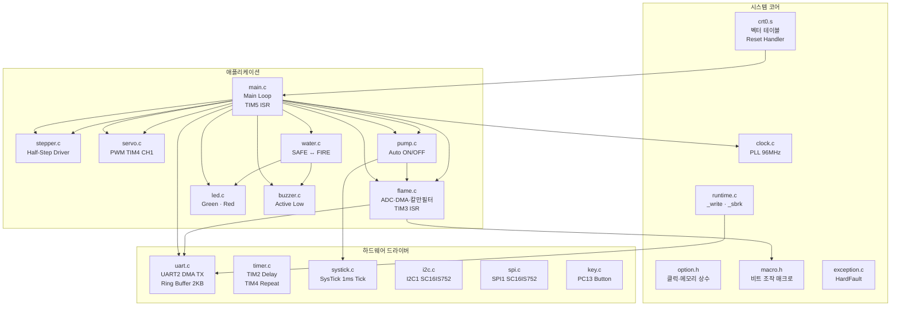

### 모듈별 역할 요약

| 모듈 | 파일 | 핵심 역할 | 사용 타이머/DMA |
|------|------|----------|----------------|
| **화염 감지** | `flame.c/h` | 4채널 ADC+DMA, 비선형 변환, 칼만 필터, 벡터 추정 | TIM3 (10ms), DMA2 Stream0 |
| **모터 제어** | `main.c` (TIM5 ISR) | EMA 평활 + 스테퍼/서보 계산 | TIM5 (50ms) |
| **수평 제어** | `stepper.c/h` | 4상 8-state 하프스텝 구동, 블로킹 스텝 실행 | TIM2 (2ms 딜레이) |
| **수직 제어** | `servo.c/h` | TIM4 CH1 PWM, 30°~150°, 펌프 작동 시 감속 | TIM4 (50Hz PWM) |
| **펌프 자동화** | `pump.c/h` | 벡터 안정 감지 → SysTick 타이머 → 자동 ON/OFF | SysTick |
| **화재 판정** | `water.c/h` | 히스테리시스 상태 머신 (임계값: 100/80) | — |
| **경보 표시** | `led.c/h`, `buzzer.c/h` | Active Low 출력, 상태별 자동 전환 | — |
| **시리얼 출력** | `uart.c`, `runtime.c` | DMA1 Stream6 기반 논블로킹 printf | DMA1 Stream6 |
| **시스템 기반** | `clock.c`, `timer.c`, `systick.c` | 96MHz PLL, 확장형 딜레이, ms 카운터 | TIM2, SysTick |

---

## 🚀 시스템 초기화 흐름

`main.c`의 `Sys_Init(230400)` 함수가 다음 순서로 전체 시스템을 초기화합니다:

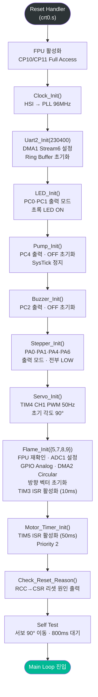

---

## ⏱ 타이머 아키텍처

시스템은 5개의 독립 타이머와 SysTick을 사용합니다:

| 타이머 | 용도 | PSC | ARR | 주기 | 우선순위 | 모듈 |
|--------|------|-----|-----|------|---------|------|
| **TIM3** | 센서 샘플링 + 칼만 필터 | 960−1 | 1000−1 | **10ms** | 0 (최고) | `flame.c` |
| **TIM5** | 모터 제어 계산 (EMA + aim) | 16000−1 | 50−1 | **50ms** | 2 | `main.c` |
| **TIM4** | 서보 PWM (CH1) | (96MHz/1MHz)−1 | 20000−1 | **20ms** (50Hz) | — | `servo.c` |
| **TIM2** | 범용 딜레이 (블로킹) | (TIMXCLK/50kHz)−1 | 가변 | 가변 | — | `timer.c` |
| **SysTick** | 펌프 타이머 (1ms Tick) | — | (HCLK/8)/1000−1 | **1ms** | 시스템 | `systick.c` |
| **DMA1 S6** | UART2 TX 완료 | — | — | 비동기 | 3 | `uart.c` |

### 타이머 클럭 계산

$$T_{\text{TIM3}} = \frac{\text{TIMXCLK}}{\text{PSC} \times \text{ARR}} = \frac{96\text{ MHz}}{960 \times 1000} = 100\text{ Hz} = 10\text{ ms}$$

$$T_{\text{TIM5}} = \frac{96\text{ MHz}}{16000 \times 50} = 120\text{ Hz} \approx 8.3\text{ ms}$$

$$T_{\text{TIM4}} = \frac{96\text{ MHz}}{96 \times 20000} = 50\text{ Hz} = 20\text{ ms}$$

$$T_{\text{SysTick}} = \frac{\text{HCLK}/8}{1000} = \frac{96\text{ MHz}/8}{1000} = 12000\text{ ticks/ms}$$

---

## 🔬 화염 감지 알고리즘

### 전체 신호 처리 파이프라인

화염 감지는 **TIM3 인터럽트(10ms 주기)** 에서 자동으로 실행되며, 텔레메트리 출력은 10회마다 1번 (100ms 유효 주기)으로 데시메이션됩니다.

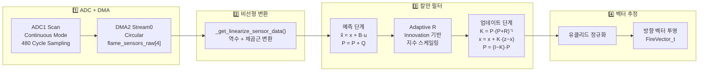

### 1단계: ADC 원시값 수집

DMA2_Stream0가 **Circular 모드**로 ADC1의 스캔 결과를 `flame_sensors_raw[4]` 버퍼에 연속 저장합니다.

**ADC 설정:**
- **스캔 모드**: 4채널 연속 (CH5 → CH7 → CH8 → CH9)
- **연속 변환**: CONT 비트 활성화
- **샘플링 시간**: 480 Cycles (0x7) — 최대 안정성
- **DMA**: DDS 비트 활성화로 Circular 모드에서 계속 요청

**DMA 설정:**
- **Stream**: DMA2_Stream0, Channel 0
- **방향**: Peripheral → Memory
- **데이터 폭**: 16-bit (Half-Word)
- **메모리 증가**: 활성화
- **Circular 모드**: 활성화

### 2단계: 비선형 변환

IR 센서의 비선형 응답 특성을 보상하기 위해 역수 변환 + 제곱근을 적용합니다. `_get_linearize_sensor_data()` 함수가 수행합니다:

$$v_i = \sqrt{\frac{65535}{\max(\text{raw}_i, 1)} - 1}$$

이 변환은 IR 센서의 역제곱 법칙 특성을 선형화합니다:
- raw 값이 작을수록(화염 가까움) → 변환 후 값이 커짐
- raw 값이 0인 경우를 방지하기 위해 최솟값 1 클램핑

### 3단계: 칼만 필터 (상세)

→ [칼만 필터 섹션](#-칼만-필터) 참조

### 4단계: 화염 벡터 추정

→ [화염 벡터 추정 섹션](#-화염-벡터-추정) 참조

---

## 🧮 칼만 필터

`feat/kalman` 브랜치에서 도입된 **4-state 적응형 칼만 필터(Adaptive Kalman Filter)** 는 센서 노이즈를 실시간으로 제거하면서도 급격한 화염 변화에 빠르게 반응합니다. 일반적인 칼만 필터에 **동적 제어 입력 행렬 B**와 **Innovation 기반 Adaptive R**을 추가하여 비정상적인 화염 환경에서도 안정적으로 동작합니다.

---

### 1. 시스템 모델 정의

#### 상태 변수

본 시스템의 **상태 벡터** $\mathbf{x} \in \mathbb{R}^4$는 4개 화염 센서의 필터링된 값입니다:

$$
\mathbf{x} = \begin{pmatrix}
x_0 \\
x_1 \\
x_2 \\
x_3
\end{pmatrix}
$$

각 $x_i$는 센서 $i$의 칼만 필터 출력(filtered value)입니다.

#### 측정 변수

**측정 벡터** $\mathbf{z} \in \mathbb{R}^4$는 비선형 변환을 거친 ADC 원시값입니다:

$$z_i = \sqrt{\frac{65535}{\max(\text{raw}_i, 1)} - 1}$$

#### 제어 입력

**제어 입력** $\mathbf{u} \in \mathbb{R}^2$는 현재 모터 구동량입니다:

$$
\mathbf{u} = \begin{pmatrix}
x_{\text{stepper}} \\
y_{\text{servo}}
\end{pmatrix}
$$

#### 시스템 모델 수식

칼만 필터의 상태 공간 모델은 다음과 같이 정의됩니다:

**State Transition:**

$$\mathbf{x}_k = \mathbf{F} \cdot \mathbf{x}_{k-1} + \mathbf{B}_k \cdot \mathbf{u}_k + \mathbf{w}_k, \quad \mathbf{w}_k \sim \mathcal{N}(\mathbf{0}, \mathbf{Q})$$

**Measurement Model:**

$$\mathbf{z}_k = \mathbf{H} \cdot \mathbf{x}_k + \mathbf{v}_k, \quad \mathbf{v}_k \sim \mathcal{N}(\mathbf{0}, \mathbf{R}_k)$$

본 시스템에서는 **등속 모델**($\mathbf{F} = \mathbf{I}$)과 **직접 관측**($\mathbf{H} = \mathbf{I}$)을 사용하므로 간소화됩니다:

$$\mathbf{x}_k = \mathbf{x}_{k-1} + \mathbf{B}_k \cdot \mathbf{u}_k + \mathbf{w}_k$$

$$\mathbf{z}_k = \mathbf{x}_k + \mathbf{v}_k$$

---

### 2. 제어 입력 행렬 $\mathbf{B}$ (동적 계산)

$\mathbf{B} \in \mathbb{R}^{4 \times 2}$는 모터 움직임이 각 센서값에 미치는 영향을 모델링합니다. **매 스텝마다 측정치 기반으로 동적 재계산**되는 것이 핵심입니다.

#### Dominant 센서 방향 판별

먼저, 어느 센서가 화염에 더 가까운지 판별합니다:

$$
d_{\text{pitch}} = \text{sign}(S_0 - S_2) = \begin{cases}
+1 & S_0 > S_2 \\
-1 & S_0 \leq S_2
\end{cases}
$$

- $+1$: 상단 센서(S0) 우세, $-1$: 하단 센서(S2) 우세

$$
d_{\text{yaw}} = \text{sign}(S_1 - S_3) = \begin{cases}
+1 & S_1 > S_3 \\
-1 & S_1 \leq S_3
\end{cases}
$$

- $+1$: 좌측 센서(S1) 우세, $-1$: 우측 센서(S3) 우세

#### $\mathbf{B}$ 행렬 구성

$$
\mathbf{B}_k = K_p \cdot \begin{pmatrix}
0 & +d_{\text{pitch}} \\
+d_{\text{yaw}} & 0 \\
0 & -d_{\text{pitch}} \\
-d_{\text{yaw}} & 0
\end{pmatrix}
$$

여기서:
- $K_p = 0.01$ — B 스케일 게인 (`KALMAN_B_Kp`)
- 열 0 ($\mathbf{u}[0]$ = stepper): S1과 S3에 영향 (Yaw 축)
- 열 1 ($\mathbf{u}[1]$ = servo): S0과 S2에 영향 (Pitch 축)
- 부호는 반대 센서 쌍에서 역전 (물리적 대칭)

> **특수 조건**: 펌프 작동 중(`pump_auto_state == 1`)이면 $\mathbf{B} = \mathbf{0}$ 으로 설정하여 모터 입력을 무시합니다. 이는 분사 중에 모터 입력이 센서 값에 미치는 영향이 달라지기 때문입니다.

---

### 3. 예측 단계 (Prediction)

이전 상태에서 현재 상태를 예측합니다:

$$\hat{\mathbf{x}}_{k|k-1} = \mathbf{x}_{k-1} + \mathbf{B}_k \cdot \mathbf{u}_k$$

오차 공분산도 프로세스 노이즈만큼 증가시킵니다:

$$\mathbf{P}_{k|k-1} = \mathbf{P}_{k-1} + \mathbf{Q}$$

여기서 $\mathbf{Q} = q \cdot \mathbf{I}_4$는 대각 프로세스 노이즈 행렬로, $q = 5.0$ (`KALMAN_Q_DIAG`)입니다.

- $q$가 **작을수록**: 예측(이전 상태)을 더 신뢰 → 반응이 느리지만 안정적
- $q$가 **클수록**: 측정값을 더 신뢰 → 반응이 빠르지만 노이즈에 민감

---

### 4. Innovation 계산

예측값과 실제 측정값의 차이(**Innovation** 또는 **잔차**)를 구합니다:

$$\mathbf{e}_k = \mathbf{z}_k - \hat{\mathbf{x}}_{k|k-1}$$

Innovation은 두 가지 역할을 합니다:
1. **칼만 이득 업데이트**: 상태를 보정하는 데 사용
2. **Adaptive R**: 측정 노이즈를 동적으로 조절하는 데 사용

---

### 5. Adaptive R (혁신 기반 측정 노이즈 적응)

일반 칼만 필터의 **고정된 $\mathbf{R}$** 은 환경 변화에 대응하지 못합니다. 본 시스템은 **Innovation 크기에 비례하여 $\mathbf{R}$의 대각 성분을 지수적으로 증가**시킵니다:

$$R_{\text{eff},ii} = R_{\text{base},ii} + \min\left(\tau, \; \alpha \cdot e^{|e_i|/\beta}\right)$$

**직관적 해석:**
- Innovation $|e_i|$가 **작을 때**: $R_{\text{eff}} \approx R_{\text{base}}$ → 측정값을 적극 반영
- Innovation $|e_i|$가 **클 때**: $R_{\text{eff}} \gg R_{\text{base}}$ → 측정값을 덜 신뢰 (이상치 방어)
- 상한 $\tau$로 $R$ 증가가 무한히 커지는 것을 방지

| 파라미터 | 기호 | 값 | 코드 상수 | 설명 |
|----------|------|-----|-----------|------|
| 스케일 강도 | $\alpha$ | 1.0 | `ADAPTIVE_R_ALPHA` | 지수 함수의 기본 스케일 |
| 민감도 | $\beta$ | 3.0 | `ADAPTIVE_R_BETA` | 작을수록 작은 innovation에도 민감 반응 |
| R 증가 상한 | $\tau$ | 3000.0 | `ADAPTIVE_R_THRESHOLD` | $R_{\text{base}}$ 대비 최대 증가량 |

**기본 측정 노이즈 공분산 $\mathbf{R}_{\text{base}}$** — 실측 데이터 `data.txt`에서 계산된 4×4 공분산 행렬:

$$
\mathbf{R}_{\text{base}} = \begin{pmatrix}
429.077 & -0.198 & -2.289 & 1.742 \\
-0.198 & 106.275 & 2.351 & -0.231 \\
-2.289 & 2.351 & 283.245 & -0.021 \\
1.742 & -0.231 & -0.021 & 70.194
\end{pmatrix}
$$

> 비대각 성분(센서 간 상관관계)이 매우 작아 센서들이 거의 독립적임을 나타냅니다. 대각 성분의 차이는 센서별 노이즈 수준 차이를 반영합니다.

---

### 6. 칼만 이득 계산 (Kalman Gain)

먼저 **Innovation 공분산** $\mathbf{S}$를 구합니다:

$$\mathbf{S}_k = \mathbf{P}_{k|k-1} + \mathbf{R}_{\text{eff}}$$

그 다음, $\mathbf{S}$의 역행렬을 이용하여 **칼만 이득** $\mathbf{K}$를 구합니다:

$$\mathbf{K}_k = \mathbf{P}_{k|k-1} \cdot \mathbf{S}_k^{-1}$$

**칼만 이득의 직관적 의미:**
- $\mathbf{K} \to \mathbf{I}$: 측정값을 완전히 신뢰 (P가 크고 R이 작을 때)
- $\mathbf{K} \to \mathbf{0}$: 예측값을 완전히 신뢰 (P가 작고 R이 클 때)

#### Gauss-Jordan 역행렬 ($\mathbf{S}^{-1}$)

4×4 행렬의 역행렬을 **Gauss-Jordan 소거법**으로 계산합니다:

1. **확장 행렬 구성**: $[\mathbf{S} \mid \mathbf{I}]$ (4×8 행렬)
2. **부분 피벗**: 각 열에서 절댓값이 최대인 행을 피벗으로 선택
3. **전방/후방 소거**: 왼쪽 절반을 $\mathbf{I}$로 변환
4. **결과 추출**: 오른쪽 절반이 $\mathbf{S}^{-1}$

> 피벗 절댓값이 $10^{-12}$ 미만이면 **특이 행렬**로 판정하고, 측정치를 직접 출력합니다.

---

### 7. 업데이트 단계 (Update)

**상태 보정** — 예측값을 칼만 이득과 Innovation으로 보정합니다:

$$\mathbf{x}_k = \hat{\mathbf{x}}_{k|k-1} + \mathbf{K}_k \cdot \mathbf{e}_k$$

**오차 공분산 갱신** — 업데이트로 불확실성이 감소합니다:

$$\mathbf{P}_k = (\mathbf{I} - \mathbf{K}_k) \cdot \mathbf{P}_{k|k-1}$$

---

### 8. 안전 장치 (Fail-Safe)

임베디드 환경에서 칼만 필터가 발산하거나 비정상 상태에 빠지는 것을 3단계로 방어합니다:

| 단계 | 조건 | 동작 |
|------|------|------|
| **역행렬 실패** | S 특이 행렬 (피벗 < 1e-12) | 측정치 직접 출력: x_out = z |
| **NaN 감지** | x[i] != x[i] (IEEE 754 NaN 자기비교) | 필터 완전 리셋: `kf_initialized = 0` |
| **초기화** | 첫 호출 시 | x = z, P = 1000·I (높은 초기 불확실성) |

---

### 9. 칼만 필터 튜닝 파라미터 요약

| 파라미터 | 값 | 정의 위치 | 설명 |
|----------|-----|-----------|------|
| $\mathbf{Q}$ (대각) | 5.0 | `KALMAN_Q_DIAG` | 프로세스 노이즈 — 클수록 측정 신뢰 |
| $\mathbf{P}_{\text{init}}$ (대각) | 1000.0 | `KALMAN_P_INIT` | 초기 오차 공분산 |
| $K_p$ (B 스케일) | 0.01 | `KALMAN_B_Kp` | 제어 입력 영향도 |
| $\alpha$ | 1.0 | `ADAPTIVE_R_ALPHA` | Adaptive R 스케일 |
| $\beta$ | 3.0 | `ADAPTIVE_R_BETA` | Adaptive R 민감도 |
| $\tau$ | 3000.0 | `ADAPTIVE_R_THRESHOLD` | Adaptive R 상한 |

---

### 10. 전체 수식 요약

한 눈에 보는 칼만 필터 전체 수식입니다:

**[Init]**

$$\mathbf{x}_0 = \mathbf{z}_0, \quad \mathbf{P}_0 = 1000 \cdot \mathbf{I}_4$$

**[Step 1. B Matrix Update]**

$$d_{\text{pitch}} = \text{sign}(z_0 - z_2), \quad d_{\text{yaw}} = \text{sign}(z_1 - z_3)$$

$$
\mathbf{B}_k = 0.01 \cdot \begin{pmatrix}
0 & d_{\text{pitch}} \\
d_{\text{yaw}} & 0 \\
0 & -d_{\text{pitch}} \\
-d_{\text{yaw}} & 0
\end{pmatrix}
$$

**[Step 2. Prediction]**

$$\hat{\mathbf{x}}_{k|k-1} = \mathbf{x}_{k-1} + \mathbf{B}_k \mathbf{u}_k$$

$$\mathbf{P}_{k|k-1} = \mathbf{P}_{k-1} + \mathbf{Q}$$

**[Step 3. Innovation]**

$$\mathbf{e}_k = \mathbf{z}_k - \hat{\mathbf{x}}_{k|k-1}$$

**[Step 4. Adaptive R]**

$$R_{\text{eff},ii} = R_{\text{base},ii} + \min\left(\tau, \; \alpha \cdot e^{|e_i|/\beta}\right)$$

**[Step 5. Kalman Gain]**

$$\mathbf{S}_k = \mathbf{P}_{k|k-1} + \mathbf{R}_{\text{eff}}$$

$$\mathbf{K}_k = \mathbf{P}_{k|k-1} \cdot \mathbf{S}_k^{-1}$$

**[Step 6. Update]**

$$\mathbf{x}_k = \hat{\mathbf{x}}_{k|k-1} + \mathbf{K}_k \cdot \mathbf{e}_k$$

$$\mathbf{P}_k = (\mathbf{I} - \mathbf{K}_k) \cdot \mathbf{P}_{k|k-1}$$

---

### 11. 칼만 필터 흐름도

위 수식을 코드 흐름으로 정리하면 다음과 같습니다:

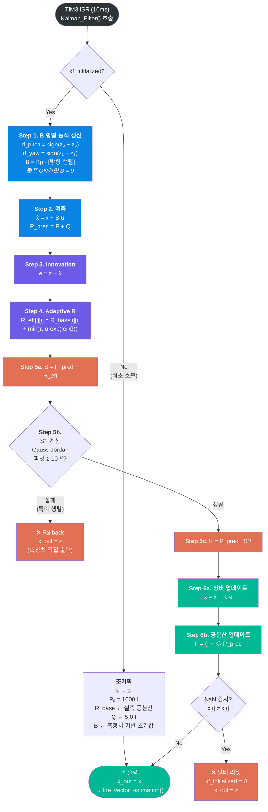

---

## 🧭 화염 벡터 추정

### 센서 배치 및 방향 벡터

4개 센서는 원형으로 90° 간격 배치되며, 각 센서의 **방향 단위 벡터** $\hat{\mathbf{d}}_i$는 회전 행렬로 생성됩니다:

$$
\hat{\mathbf{d}}_i = \begin{pmatrix}
-\sin(2\pi i / N) \\
\cos(2\pi i / N)
\end{pmatrix}, \quad i = 0, 1, \dots, N-1, \quad N = 4
$$

| 센서 | 각도 | 방향 벡터 $(d_x, d_y)$ | 물리 위치 |
|------|------|----------------------|----------|
| S0 | 0° | $(0.0,\; 1.0)$ | 12시 (전방) |
| S1 | 90° | $(-1.0,\; 0.0)$ | 9시 (좌측) |
| S2 | 180° | $(0.0,\; -1.0)$ | 6시 (후방) |
| S3 | 270° | $(1.0,\; 0.0)$ | 3시 (우측) |

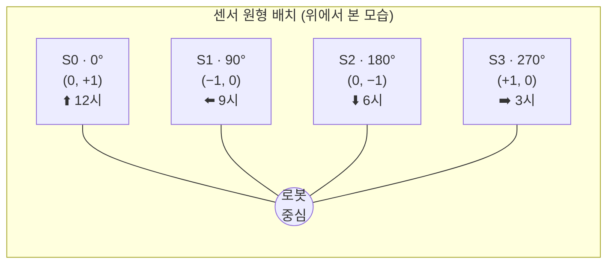

### 방향 벡터 초기화 (`_Init_Directional_Component_Vector`)

첫 번째 벡터 $\hat{\mathbf{d}}_0 = (0, 1)$에서 시작하여, 2D 회전 행렬을 반복 곱하여 나머지 벡터를 생성합니다:

$$
\hat{\mathbf{d}}_i = R(\theta) \cdot \hat{\mathbf{d}}_{i-1} = \begin{pmatrix}
\cos\theta & -\sin\theta \\
\sin\theta & \cos\theta
\end{pmatrix} \hat{\mathbf{d}}_{i-1}, \quad \theta = \frac{2\pi}{N}
$$

### 벡터 계산 (`fire_vector_estimation`)

**유클리드 정규화**:

$$\hat{v}_i = \frac{f_i}{\|\mathbf{f}\|}, \quad \|\mathbf{f}\| = \sqrt{\sum_{i=0}^{N-1} f_i^2}$$

여기서 $f_i$는 칼만 필터 출력값 `flame_sensors_linearized[i]`입니다.

**화염 방향 벡터**:

$$F_x = -\frac{1}{N} \sum_{i=0}^{N-1} \hat{v}_i \cdot d_{i,x}$$

$$F_y = -\frac{1}{N} \sum_{i=0}^{N-1} \hat{v}_i \cdot d_{i,y}$$

**평균 화염 강도**:

$$I = \frac{1}{N} \sum_{i=0}^{N-1} f_i$$

> **부호 반전**: $F_x$와 $F_y$ 모두 부호가 반전됩니다. 이는 센서가 화염 **반대편**에서 반응하기 때문에, 화염의 실제 방향을 가리키도록 보정하는 것입니다.

---

## 🎮 제어 시스템

### 모터 제어 ISR (TIM5 — 50ms 주기)

`TIM5_IRQHandler()`에서 모터 제어 계산이 수행됩니다. **블로킹 없이** 계산만 수행하고, 실제 스테퍼 구동은 메인 루프에서 실행합니다.

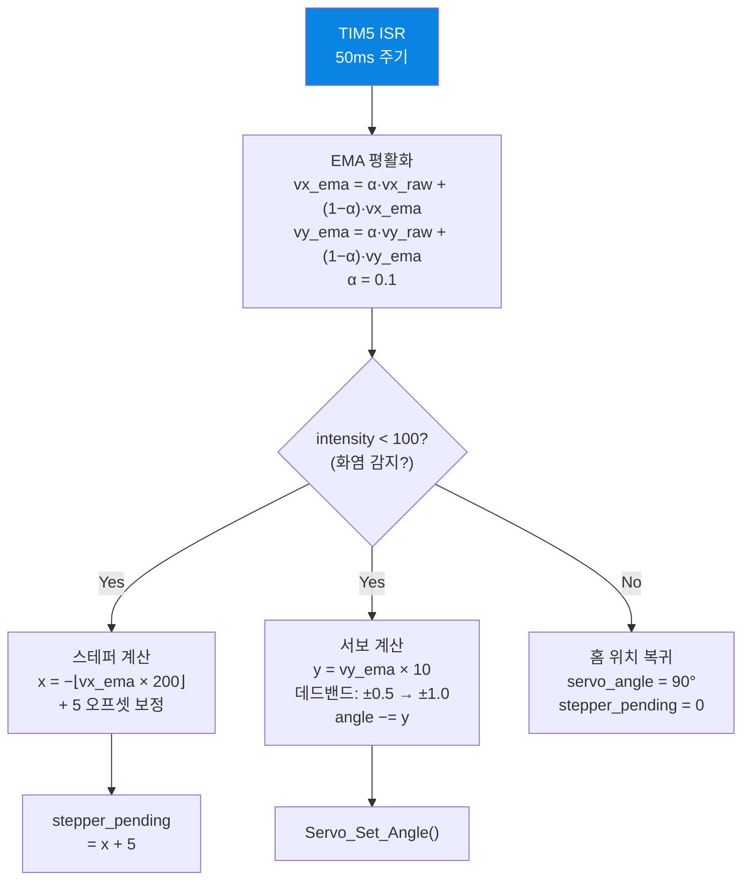

### EMA (지수 이동 평균) 평활화

모터 제어 입력의 급격한 변화를 억제하기 위해 화염 벡터에 EMA를 적용합니다:

$$vx_n = \alpha \cdot vx^{raw}_n + (1 - \alpha) \cdot vx_{n-1}, \quad \alpha = 0.1$$

$$vy_n = \alpha \cdot vy^{raw}_n + (1 - \alpha) \cdot vy_{n-1}$$

$\alpha = 0.1$은 약 10 프레임(500ms)의 시정수를 가지며, 높은 주파수 노이즈를 효과적으로 억제합니다.

### 수평 제어 (스테퍼 모터 — Pan)

$$\text{steps} = -\lfloor \text{vx} \times 200 \rfloor + 5$$

| 파라미터 | 값 | 코드 상수 | 설명 |
|----------|-----|-----------|------|
| 구동 방식 | 8-state Half-Step | `step_table[8][4]` | 부드러운 미세 회전 |
| 스텝 딜레이 | 2ms / step | `STEP_DELAY_MS` | TIM2 블로킹 딜레이 |
| 서보 활성화 데드밴드 | ±1 steps | `AIM_SERVO_ACT_DEADBAND` | 미세 진동 방지 |
| 스테퍼 활성화 데드밴드 | ±2 steps | `AIM_STEPPER_ACT_DEADBAND` | 이하면 무시 |
| Active 전환 임계값 | ±8 steps | `STEPPER_X_DEADBAND` | 이 이상일 때 Active 모드 |
| 펌프 작동 시 | 속도 1/10 감속 | `steps /= 10` | 분사 안정성 확보 |

**8-state Half-Step 시퀀스:**

| Step | Phase A (PA0) | Phase B (PA1) | Phase C (PA4) | Phase D (PA6) |
|------|:---:|:---:|:---:|:---:|
| 0 | 1 | 0 | 0 | 0 |
| 1 | 1 | 0 | 0 | 1 |
| 2 | 0 | 0 | 0 | 1 |
| 3 | 0 | 0 | 1 | 1 |
| 4 | 0 | 0 | 1 | 0 |
| 5 | 0 | 1 | 1 | 0 |
| 6 | 0 | 1 | 0 | 0 |
| 7 | 1 | 1 | 0 | 0 |

> 구동 완료 후 `Stepper_Release()`로 모든 Phase를 LOW로 설정하여 발열을 방지합니다.

### 수직 제어 (서보 모터 — Tilt)

$$y = \text{vy} \times 10$$

$$
y_{\text{clamp}} = \begin{cases}
+1.0 & y > 0.5 \\
-1.0 & y < -0.5 \\
y & \text{else}
\end{cases}
$$

$$\theta_{n+1} = \theta_n - y_{\text{clamp}}, \quad \theta \in [30, 150]$$

| 파라미터 | 값 | 코드 상수 | 설명 |
|----------|-----|-----------|------|
| PWM 주파수 | 50 Hz | TIM4 ARR=20000 | 표준 서보 신호 |
| 펄스 범위 | 500µs ~ 2500µs | `Servo_Set_Angle()` | 0° ~ 180° 매핑 |
| 초기 각도 | 90° | `SERVO_INIT_ANGLE` | 시작 위치 |
| 각도 범위 | 30° ~ 150° | `SERVO_MIN/MAX_ANGLE` | 소프트웨어 클램핑 |
| 데드밴드 | ±0.5 | `y > 0.5 ? 1.0 : ...` | 미세 진동 방지 |
| 펌프 작동 시 | 펄스 1/10 감소 | `pulse /= 10` | 분사 안정성 확보 |

**PWM 펄스 폭 계산:**

$$\text{pulse}(\theta) = 500 + \left\lfloor \frac{2000 \cdot \theta}{180} \right\rfloor \quad (\mu s)$$

---

## 🚦 상태 머신

### 화재 상태 (히스테리시스)

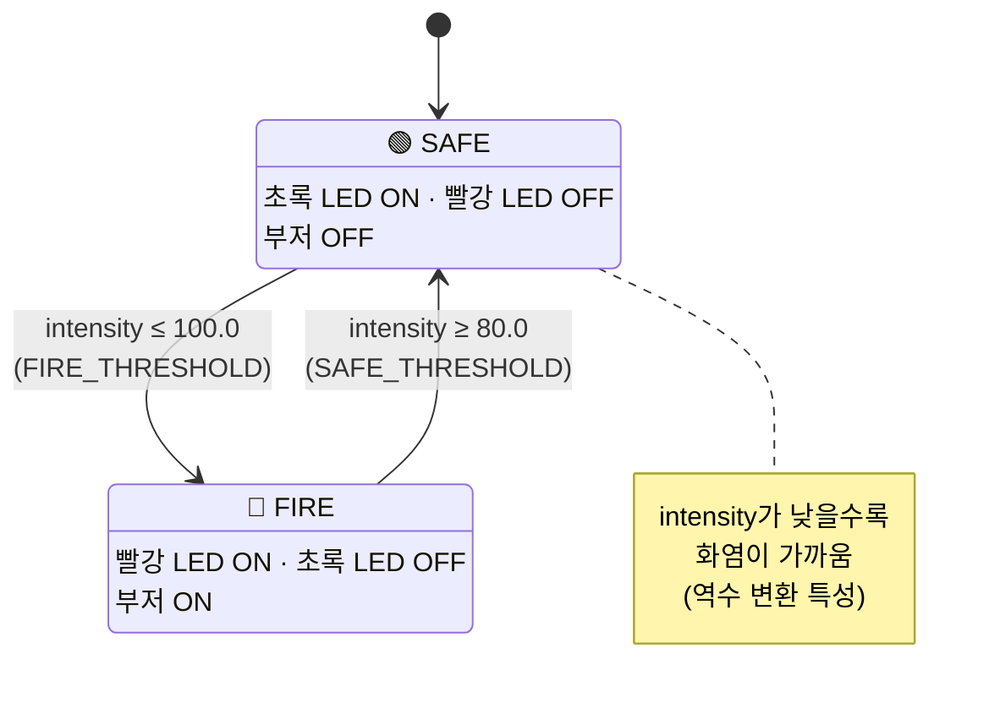

| 상태 | 초록 LED | 빨강 LED | 부저 | 전환 조건 |
|------|:--------:|:--------:|:----:|----------|
| **SAFE** (안전) | ON | OFF | OFF | intensity ≥ 80.0 (`SAFE_THRESHOLD`) |
| **FIRE** (화재) | OFF | ON | ON | intensity ≤ 100.0 (`FIRE_THRESHOLD`) |
| **히스테리시스** | 이전 유지 | 이전 유지 | 이전 유지 | 80.0 < intensity < 100.0 |

> **역방향 임계값 주의**: IR 센서의 역수 변환 특성상, **intensity가 낮을수록 화염이 가까운** 상태입니다. 따라서 `FIRE_THRESHOLD(100) > SAFE_THRESHOLD(80)` 입니다.

### 워터 펌프 자동 제어

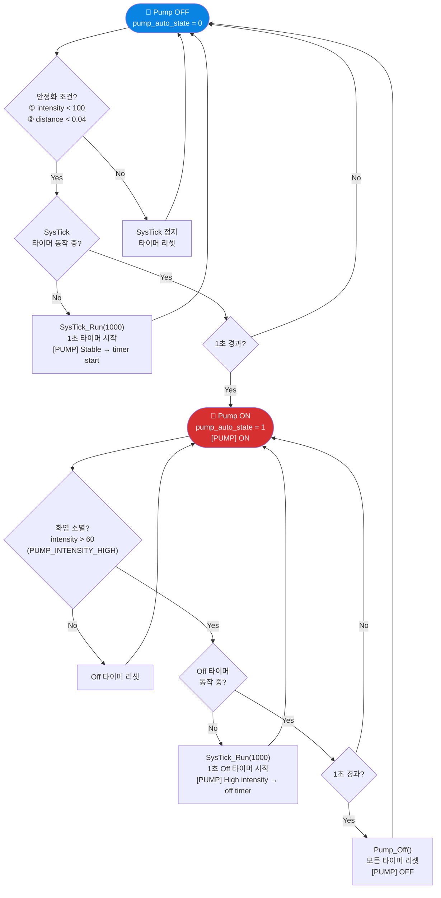

**안정화 조건** (`pump.c`):

$$\text{stable} = (\text{intensity} < 100) \;\wedge\; \Big(\sqrt{v_x^2 + v_y^2} < 0.04\Big)$$

| 파라미터 | 값 | 코드 상수 | 설명 |
|----------|-----|-----------|------|
| 안정 강도 임계값 | 100.0 | `PUMP_INTENSITY_LOW` | intensity 이하 시 안정 판정 |
| 벡터 데드밴드 | 0.04 | `PUMP_VECTOR_DEADBAND` | 화염 벡터 유클리드 거리 |
| 안정 → ON 대기 | 1000ms | `PUMP_STABLE_DELAY_MS` | 연속 안정 유지 시간 |
| 소멸 강도 임계값 | 60.0 | `PUMP_INTENSITY_HIGH` | intensity 이상 시 소멸 판정 |
| ON → OFF 대기 | 1000ms | `PUMP_OFF_DELAY_MS` | 연속 소멸 유지 시간 |

---

## 📡 UART DMA 전송 시스템

### 아키텍처

`printf()` 호출이 ISR을 블로킹하지 않도록, **DMA1 Stream6 기반 비동기 링 버퍼 전송**을 구현합니다.

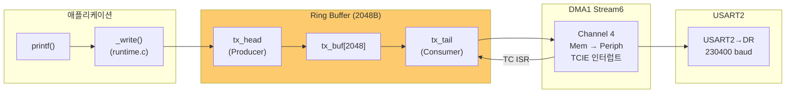

### 데이터 흐름

1. `printf()` → `_write()` → `Uart2_DMA_Write()`: 데이터를 링 버퍼에 삽입 (`\n` → `\r\n` 자동 변환)
2. 인터럽트 비활성화 상태에서 원자적으로 버퍼 기록
3. DMA 미동작 시 `Uart2_DMA_Kick()` 호출하여 전송 시작
4. DMA Transfer Complete ISR에서 다음 청크 전송 (`Uart2_DMA_Kick()` 재호출)
5. 링 버퍼 wrap-around 시 경계까지만 전송 후 ISR에서 나머지 전송

### 설정값

| 항목 | 값 | 설명 |
|------|-----|------|
| 보드레이트 | 230400 | `Uart2_Init(230400)` |
| 링 버퍼 크기 | 2048 bytes | `TX_BUF_SIZE` |
| DMA 채널 | DMA1 Stream6, Channel 4 | USART2_TX 전용 |
| ISR 우선순위 | 3 | 센서(0), 모터(2)보다 낮음 |
| 또한 지원 | 블로킹 전송 | `Uart2_Send_Byte()` — HardFault용 |

---

## 📊 실시간 모니터링 도구

### live_monitor.py

PC에서 UART 시리얼 데이터를 수신하여 **실시간 그래프 + GIF 녹화**를 수행하는 Python 대시보드입니다.

**실행 방법:**

```bash
cd analysis
pip install numpy matplotlib pyserial pillow
python live_monitor.py
```

**설정 변경** (`live_monitor.py` 상단):

```python
COM_PORT = "COM3"      # 시리얼 포트
BAUD = 230400          # 보드레이트 (펌웨어와 일치)
SAVE_GIF = True        # GIF 저장 여부
GIF_FPS = 20           # GIF 프레임 레이트
MAX_GIF_FRAMES = 600   # 최대 프레임 (600 = 약 30초)
```

### 대시보드 구성

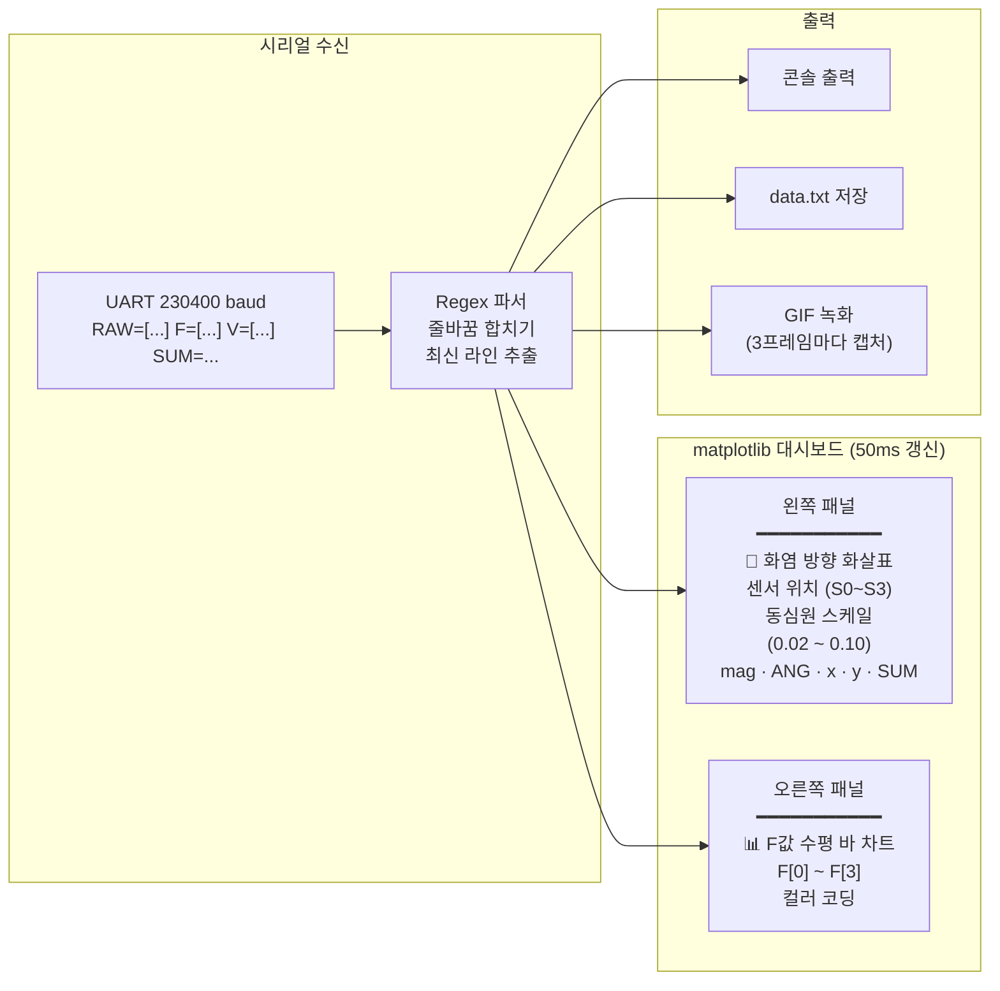

### 화염 벡터 재계산

모니터링 도구는 PC 측에서 독자적으로 화염 벡터를 재계산합니다 (검증용):

```python
sensor_dirs = [(-sin(i·2π/4), cos(i·2π/4)) for i in range(4)]
f_normalized = f / ||f||
vx = -Σ(sensor_dirs[i][0] · f_normalized[i]) / 4
vy = -Σ(sensor_dirs[i][1] · f_normalized[i]) / 4
```

### GIF 녹화

- 3프레임마다 1회 캡처 (메모리 절약)
- `canvas.buffer_rgba()` 직접 사용 — `savefig` 대비 10배 이상 빠름
- 종료 시 자동으로 `fire_monitor_YYYYMMDD_HHMMSS.gif` 저장

---

## 🛠 빌드 및 플래싱

### 요구 사항

| 도구 | 버전 | 설명 |
|------|------|------|
| **ARM GNU Toolchain** | v15.2.1 | `arm-none-eabi-gcc` |
| **STM32CubeProgrammer** | CLI | SWD 플래싱용 |
| **GNU Make** | — | 빌드 자동화 |

### 빌드

```bash
cd src
make all
```

**빌드 결과물:**

| 파일 | 설명 |
|------|------|
| `rom_0x08000000.elf` | ELF 실행 파일 |
| `rom_0x08000000.bin` | 바이너리 이미지 |
| `rom_0x08000000.map` | 링커 맵 파일 |
| `__dump.txt` | 심볼 디스어셈블리 |
| `__dump_all.txt` | 소스 포함 전체 디스어셈블리 |

### 플래싱

```bash
cd src
make flash
```

내부적으로 실행되는 명령:

```bash
STM32_Programmer_CLI.exe -c port=SWD mode=UR reset=HWrst freq=1000 -w ./rom_0x08000000.elf -v -rst -q
```

### 클린 빌드

```bash
cd src
make clean
make all
```

### 컴파일 옵션

| 옵션 | 설명 |
|------|------|
| `-mcpu=cortex-m4` | Cortex-M4 타겟 |
| `-mthumb` | Thumb 명령어 세트 |
| `-mfpu=fpv4-sp-d16` | 단정밀도 FPU 사용 |
| `-mfloat-abi=softfp` | 소프트 FP ABI (하드 FP 연산) |
| `-O3` | 최대 최적화 |
| `-std=gnu99` | GNU C99 표준 |
| `-DSTM32F411xE` | 타겟 MCU 정의 |
| `-fno-builtin` | 내장 함수 비활성화 |
| `-funsigned-char` | char를 unsigned로 |
| `-fno-strict-aliasing` | 앨리어싱 최적화 비활성화 |
| `--specs=nano.specs` | Newlib Nano (소형 libc) |
| `-u _printf_float` | printf 부동소수점 지원 |
| `-nostartfiles` | 기본 스타트업 비사용 (crt0.s) |

### 메모리 레이아웃

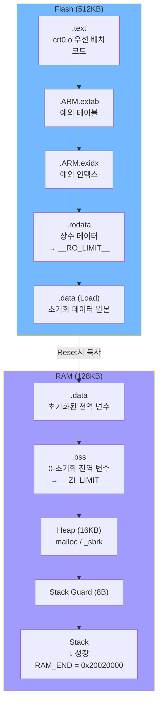

---

## 📂 프로젝트 구조

### 레지스터 비트 조작 매크로 (`macro.h`)

| 매크로 | 기능 | 예시 |
|--------|------|------|
| `Macro_Set_Bit(dest, pos)` | 특정 비트 SET | `Macro_Set_Bit(RCC->AHB1ENR, 0)` |
| `Macro_Clear_Bit(dest, pos)` | 특정 비트 CLEAR | `Macro_Clear_Bit(TIM2->CR1, 0)` |
| `Macro_Invert_Bit(dest, pos)` | 특정 비트 반전 | — |
| `Macro_Write_Block(dest, bits, data, pos)` | 블록 쓰기 | `Macro_Write_Block(GPIOA->MODER, 0x3, 0x2, 4)` |
| `Macro_Extract_Area(dest, bits, pos)` | 블록 읽기 | `Macro_Extract_Area(RCC->CFGR, 0x3, 2)` |
| `Macro_Check_Bit_Set(dest, pos)` | 비트 SET 확인 | `while(!Macro_Check_Bit_Set(USART2->SR, 7))` |
| `Macro_Check_Bit_Clear(dest, pos)` | 비트 CLEAR 확인 | `while(Macro_Check_Bit_Clear(TIM2->SR, 0))` |

### 벡터 테이블 (`crt0.s`)

ARM Cortex-M4 벡터 테이블에 총 97개 엔트리가 정의되어 있습니다:
- **위치 0**: Stack Pointer 초기값 (`0x20020000`)
- **위치 1**: Reset Handler (`__start`)
- **위치 2~15**: 시스템 예외 (NMI, HardFault, SysTick 등)
- **위치 16~96**: 외부 인터럽트 (DMA, TIM, USART, SPI, I2C 등)

사용하지 않는 인터럽트는 `Invalid_ISR`(`_Invalid_ISR`)로 약한 링크되어, 실행 시 ISR 번호를 UART로 출력하고 무한 루프에 진입합니다.

---

## 📡 시리얼 출력 포맷

UART2 (230400 baud, DMA TX)를 통해 **100ms 주기** (TIM3 10ms × 데시메이션 10)로 텔레메트리 데이터가 출력됩니다:

```
RAW=[val0 val1 val2 val3] F=[f0 f1 f2 f3] V=[vx vy] SUM=intensity x=pan y=tilt ANG=servo_angle
```

| 필드 | 설명 | 타입 | 범위 |
|------|------|------|------|
| `RAW[n]` | ADC 원시값 | uint16 | 0 ~ 65535 |
| `F[n]` | 칼만 필터 출력 (비선형 변환 + 필터링) | float | 0.0 ~ ∞ |
| `V[vx vy]` | 화염 방향 벡터 (정규화) | float | −1.0 ~ 1.0 |
| `SUM` | 평균 화염 강도 | float | 0.0 ~ ∞ |
| `x` | 스테퍼 이동량 (수평 보정값) | int | 정수 |
| `y` | 서보 이동량 (수직 보정값) | float | −1.0 ~ 1.0 |
| `ANG` | 현재 서보 각도 | float | 30.0 ~ 150.0 |

**상태 변경 메시지:**

```
[STATE CHANGE] SAFE -> FIRE (Intensity=XX.XXXX)
[SAFE] 초록LED ON / 빨간LED OFF / 부저 OFF / 펌프 OFF
[FIRE] 초록LED OFF / 빨간LED ON / 부저 ON / 펌프 ON
[PUMP] Stable -> timer start
[PUMP] ON
[PUMP] High intensity -> off timer
[PUMP] Stable broken -> reset
[PUMP] Intensity cleared -> reset
[PUMP] OFF
```

---

## 🔄 메인 루프 흐름

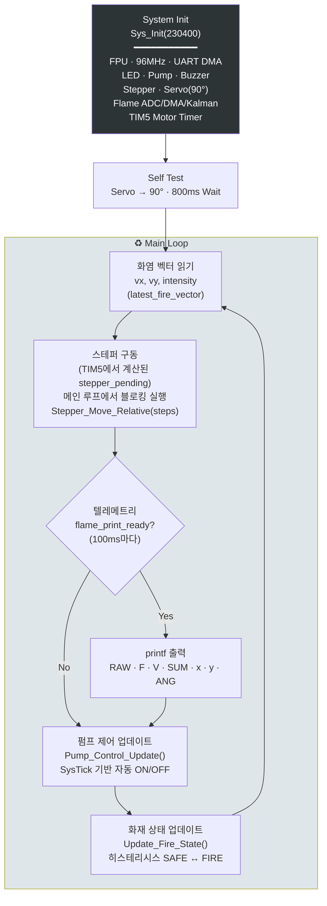

### 타이밍 다이어그램

```
시간 →  0ms   10ms   20ms   30ms   40ms   50ms   60ms   ...  100ms
        │      │      │      │      │      │      │           │
TIM3:   ┃━━━━━┃━━━━━┃━━━━━┃━━━━━┃━━━━━┃━━━━━┃━━━━━━━━━━━━━┃
        │칼만  │칼만  │칼만  │칼만  │칼만  │칼만  │            │칼만+Print
        │      │      │      │      │      │      │           │
TIM5:   ┃━━━━━━━━━━━━━━━━━━━━━━━━━┃━━━━━━━━━━━━━━━━━━━━━━━━━┃
        │                          │EMA+Motor                 │
        │                          │                          │
Main:   ┃─stepper─pump─fire────────┃─stepper─pump─fire────────┃
```

---

## ⚠️ 예외 처리

### HardFault 핸들러 (`exception.c`)

HardFault 발생 시 다음 레지스터를 **블로킹 UART 전송**으로 덤프합니다 (DMA 미사용):

| 레지스터 | 설명 |
|----------|------|
| `SCB->HFSR` | Hard Fault Status Register |
| `SCB->CFSR` | Configurable Fault Status (UsageFault + BusFault + MemManage) |
| `SCB->MMFAR` | MemManage Fault Address |
| `SCB->BFAR` | Bus Fault Address |

### 리셋 원인 확인

부팅 시 `RCC->CSR`을 읽어 리셋 원인을 출력합니다:

| 비트 | 의미 |
|------|------|
| Bit 31 | Low-power reset |
| Bit 30 | Window watchdog reset |
| Bit 29 | Independent watchdog reset |
| Bit 28 | Software reset |
| Bit 27 | POR/PDR reset |
| Bit 26 | PIN reset |
| Bit 25 | BOR reset |

---

## 📄 라이선스

이 프로젝트는 [MIT License](LICENSE)를 따릅니다.

Copyright (c) 2026 산에사는가재

---

<p align="center">
  <b>the-Photatos</b> — 부실한 감자들의 노력 🥔🔥
</p>
