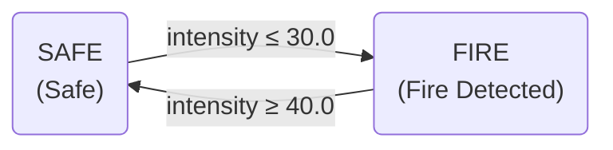
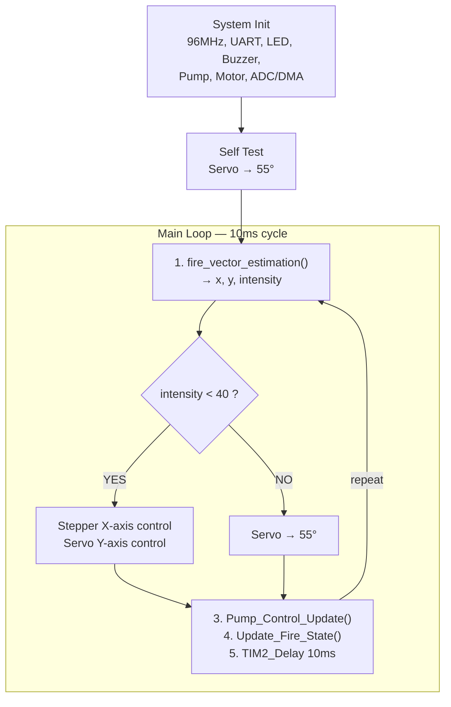

# 🔥 the-Photatos — 자율 소화 로봇 시스템

> **부실한 감자들의 노력**  
> STM32F411 기반 적외선 화염 감지 및 자동 소화 로봇

---

## 📋 목차

- [프로젝트 개요](#-프로젝트-개요)
- [시스템 아키텍처](#-시스템-아키텍처)
- [하드웨어 구성](#-하드웨어-구성)
- [핀 배치표](#-핀-배치표)
- [소프트웨어 구조](#-소프트웨어-구조)
- [화염 감지 알고리즘](#-화염-감지-알고리즘)
- [제어 시스템](#-제어-시스템)
- [상태 머신](#-상태-머신)
- [실시간 모니터링 도구](#-실시간-모니터링-도구)
- [빌드 및 플래싱](#-빌드-및-플래싱)
- [프로젝트 구조](#-프로젝트-구조)
- [시리얼 출력 포맷](#-시리얼-출력-포맷)
- [라이선스](#-라이선스)

---

## 🎯 프로젝트 개요

**the-Photatos**는 4채널 적외선(IR) 화염 센서 어레이를 사용하여 화염의 방향과 강도를 실시간으로 감지하고, 스테퍼 모터(수평 회전)와 서보 모터(수직 틸트)로 노즐을 정밀 조준한 뒤, 자동으로 워터 펌프를 가동하여 소화하는 **자율 소화 로봇 시스템**입니다.

### 핵심 기능

| 기능 | 설명 |
|------|------|
| **화염 감지** | 4채널 IR 센서 어레이 (90° 간격 원형 배치), DMA 기반 연속 ADC 샘플링 |
| **방향 추정** | 센서 값을 방향 단위 벡터에 투영하여 2D 화염 벡터(x, y) 계산 |
| **자동 조준** | 스테퍼 모터(수평 Pan) + 서보 모터(수직 Tilt) 비례 제어 |
| **자동 소화** | 조준 안정화 5초 후 워터 펌프 자동 ON, 화염 소멸 시 자동 OFF |
| **상태 표시** | LED(초록/빨강) + 부저로 안전/화재 상태 표시 |
| **실시간 모니터링** | Python 기반 시리얼 파싱 + matplotlib 실시간 대시보드 |

---

## 🏗 시스템 아키텍처

```
                    ┌─────────────────────────────┐
                    │        STM32F411xE           │
                    │      (ARM Cortex-M4)         │
                    │        96 MHz                │
                    ├─────────────────────────────┤
                    │                             │
   IR 화염 센서 x4 ─┤  ADC1 (DMA2 Circular)      │
   (PC5,PC7,PC8,PC9)│  → flame_sensors_raw[4]     │
                    │  → 신호 처리 파이프라인       │
                    │  → FireVector_t {x, y, I}   │
                    │                             │
                    │  TIM3 IRQ (100ms 주기)       │──→ UART2 텔레메트리 출력
                    │  → 센서 데이터 처리           │    (PA2/PA3, 115200 baud)
                    │  → 화염 벡터 계산             │
                    │                             │
                    │  Main Loop (10ms 주기)       │
                    │  ├─ 스테퍼 제어 (X축)        │──→ 스테퍼 모터 (PA0,PA1,PA4,PA6)
                    │  ├─ 서보 제어 (Y축)          │──→ 서보 모터 (PB6, TIM4 CH1 PWM)
                    │  ├─ 펌프 상태 업데이트        │──→ 워터 펌프 릴레이 (PC4)
                    │  └─ 화재 상태 머신            │──→ LED (PC0,PC1) + 부저 (PC2)
                    └─────────────────────────────┘
                              │
                              │ UART2 (115200)
                              ▼
                    ┌─────────────────────────────┐
                    │   PC (live_monitor.py)       │
                    │   matplotlib 실시간 대시보드  │
                    │   ├─ 화염 방향 화살표         │
                    │   └─ 센서별 강도 바 차트      │
                    └─────────────────────────────┘
```

---

## 🔧 하드웨어 구성

### MCU 사양

| 항목 | 사양 |
|------|------|
| **MCU** | STM32F411xE (ARM Cortex-M4F) |
| **시스템 클럭** | 96 MHz (PLL 구성) |
| **Flash** | 512 KB (0x08000000 ~ 0x0807FFFF) |
| **RAM** | 128 KB (0x20000000 ~ 0x2001FFFF) |
| **FPU** | 단정밀도 부동소수점 (FPv4-SP) |
| **APB1 버스** | 48 MHz (타이머 PCLK1×2 = 96 MHz) |
| **APB2 버스** | 96 MHz |

### 주변 장치

| 장치 | 수량 | 용도 |
|------|------|------|
| **IR 화염 센서** | 4개 | 화염 방향·강도 감지 (ADC CH5, CH7, CH8, CH9) |
| **스테퍼 모터** | 1개 | 수평 회전 (Pan) — 4상 하프스텝 구동 |
| **서보 모터** | 1개 | 수직 틸트 (Tilt) — 50Hz PWM |
| **워터 펌프** | 1개 | 소화용 물 분사 (릴레이 제어) |
| **LED (초록)** | 1개 | 안전 상태 표시 (Active Low) |
| **LED (빨강)** | 1개 | 화재 상태 표시 (Active Low) |
| **부저** | 1개 | 화재 경보 (Active Low) |

---

## 📌 핀 배치표

### GPIOA

| 핀 | 기능 | 설명 |
|----|------|------|
| PA0 | GPIO Output | 스테퍼 모터 Phase A |
| PA1 | GPIO Output | 스테퍼 모터 Phase B |
| PA2 | AF (UART2 TX) | 디버그 시리얼 출력 |
| PA3 | AF (UART2 RX) | 디버그 시리얼 입력 |
| PA4 | GPIO Output | 스테퍼 모터 Phase C |
| PA6 | GPIO Output | 스테퍼 모터 Phase D |

### GPIOB

| 핀 | 기능 | 설명 |
|----|------|------|
| PB6 | AF (TIM4 CH1) | 서보 모터 PWM 출력 |

### GPIOC

| 핀 | 기능 | 설명 |
|----|------|------|
| PC0 | GPIO Output | 초록 LED (Active Low) |
| PC1 | GPIO Output | 빨강 LED (Active Low) |
| PC2 | GPIO Output | 부저 (Active Low) |
| PC4 | GPIO Output | 워터 펌프 릴레이 |
| PC5 | Analog (ADC CH15→5) | 화염 센서 0 |
| PC7 | Analog (ADC CH7) | 화염 센서 1 |
| PC8 | Analog (ADC CH8) | 화염 센서 2 |
| PC9 | Analog (ADC CH9) | 화염 센서 3 |
| PC13 | GPIO Input | 사용자 버튼 |

---

## 📂 소프트웨어 구조

### 디렉토리 레이아웃

```
the-Photatos/
├── README.md                   # 프로젝트 문서
├── LICENSE                     # 라이선스
├── location.py                 # (예비 코드)
│
├── src/                        # 펌웨어 소스코드 (Bare-metal C)
│   ├── main.c                  # 메인 루프 및 시스템 초기화
│   ├── Makefile                # 빌드 스크립트
│   ├── rom_0x08000000.lds      # 링커 스크립트
│   ├── crt0.s                  # 스타트업 어셈블리 (벡터 테이블, Reset 핸들러)
│   │
│   ├── flame.c / flame.h       # 화염 센서 ADC/DMA + 신호 처리 + 벡터 추정
│   ├── stepper.c / stepper.h   # 스테퍼 모터 드라이버 (수평 Pan)
│   ├── servo.c / servo.h       # 서보 모터 PWM 드라이버 (수직 Tilt)
│   ├── pump.c / pump.h         # 워터 펌프 릴레이 제어 (자동 ON/OFF 로직)
│   ├── water.c / water.h       # 화재 상태 머신 (히스테리시스 적용)
│   ├── led.c / led.h           # LED 드라이버 (초록/빨강)
│   ├── buzzer.c / buzzer.h     # 부저 드라이버
│   │
│   ├── clock.c                 # PLL 시스템 클럭 설정 (96 MHz)
│   ├── timer.c                 # TIM2 딜레이 / TIM4 PWM 함수
│   ├── systick.c               # SysTick 타이머 (펌프 안정화 타임아웃)
│   ├── uart.c                  # UART1/UART2 드라이버
│   ├── adc.c                   # ADC 공용 코드
│   ├── i2c.c                   # I2C1 드라이버 (SC16IS752 확장)
│   ├── spi.c                   # SPI1 드라이버 (SC16IS752 확장)
│   ├── key.c                   # 버튼 입력 (PC13)
│   │
│   ├── runtime.c               # libc 스텁 (_write, _sbrk)
│   ├── exception.c             # HardFault / 예외 핸들러 (디버그 출력)
│   ├── system_stm32f4xx.c/h    # CMSIS 시스템 초기화
│   ├── stm32f411xe.h           # MCU 레지스터 정의
│   ├── stm32f4xx.h             # STM32F4 시리즈 공통 헤더
│   ├── core_cm4.h              # ARM Cortex-M4 코어 레지스터
│   ├── cmsis_*.h               # CMSIS 컴파일러 추상화 헤더
│   ├── mpu_armv7.h             # MPU 정의
│   ├── device_driver.h         # 전체 extern 선언 (통합 헤더)
│   ├── macro.h                 # 레지스터 비트 조작 매크로
│   └── option.h                # 클럭/RAM/힙 설정 상수
│
└── analysis/                   # PC측 분석 도구
    ├── live_monitor.py         # 실시간 화염 방향 모니터링 대시보드
    └── analysis.ipynb          # 데이터 후처리 분석 노트북
```

### 모듈별 역할 요약

| 모듈 | 파일 | 핵심 역할 |
|------|------|----------|
| **화염 감지** | `flame.c/h` | 4채널 ADC + DMA 원형 버퍼, 정규화·필터링·벡터 추정 |
| **수평 제어** | `stepper.c/h` | 4상 하프스텝 구동, 비례 제어 (X축) |
| **수직 제어** | `servo.c/h` | TIM4 CH1 PWM (50Hz), 비례 제어 (Y축) |
| **펌프 자동화** | `pump.c/h` | 안정화 감지 → 5초 타이머 → 자동 ON/OFF |
| **화재 판정** | `water.c/h` | 히스테리시스 상태 머신 (SAFE ↔ FIRE) |
| **경보 표시** | `led.c/h`, `buzzer.c/h` | 상태별 LED·부저 제어 |
| **시스템 기반** | `clock.c`, `timer.c`, `systick.c`, `uart.c` | 클럭, 딜레이, 타임아웃, 시리얼 통신 |

---

## 🔬 화염 감지 알고리즘

### 신호 처리 파이프라인

화염 감지는 TIM3 인터럽트(100ms 주기)에서 자동으로 실행됩니다:

#### 1단계: ADC 원시값 수집

DMA2_Stream0이 Circular 모드로 `flame_sensors_raw[4]` 버퍼에 연속 저장합니다.

#### 2단계: 정규화 & 비선형 변환

IR 센서의 비선형 응답 특성을 보상하기 위해 역수 변환 + 제곱근을 적용합니다:

$$v = \sqrt{\frac{\texttt{0xFFFF}}{\text{raw}} - 1}$$

#### 3단계: 슬라이딩 윈도우 필터 (이상치 제거)

$N = 100$개 샘플을 수집한 뒤 **정렬**하고:  

$$\bar{v}_j = \sum_{k=50}^{149} v_{j}^{(k)} \quad \text{(중간 50개만 사용)}$$

#### 4단계: 지수 이동 평균 (EMA)

매 프레임마다 기저선(Baseline)을 적응적으로 추적합니다:

$$\text{EMA}_n = \alpha \cdot x_n + (1 - \alpha) \cdot \text{EMA}_{n-1}, \quad \alpha = 0.01$$

#### 5단계: 기저선 보상

순수 화염 성분만 추출합니다:

$$\text{output}_i = \text{filtered}_i - \text{baseline}_i$$

#### 6단계: 화염 벡터 추정

센서값을 유클리드 정규화한 뒤 방향 단위 벡터에 투영하여 `FireVector_t { x, y, intensity }`를 출력합니다.

### 방향 벡터 계산

4개 센서가 원형으로 90° 간격 배치되어 있으며, 각 센서의 방향 단위 벡터는 회전 행렬로 계산됩니다:

| 센서 | 각도 | 방향 벡터 (x, y) |
|------|------|------------------|
| S0 | 0° (12시) | (0.0, 1.0) |
| S1 | 90° (9시) | (-1.0, 0.0) |
| S2 | 180° (6시) | (0.0, -1.0) |
| S3 | 270° (3시) | (1.0, 0.0) |

각 센서의 방향 단위 벡터 $\hat{d}_i$는 회전 행렬로 생성됩니다:

$$\hat{d}_i = \begin{pmatrix} -\sin\!\left(\frac{2\pi i}{N}\right) \\ \cos\!\left(\frac{2\pi i}{N}\right) \end{pmatrix}, \quad i = 0, 1, \dots, N{-}1$$

먼저 센서 값을 유클리드 정규화합니다:

$$\hat{v}_i = \frac{f_i}{\|\mathbf{f}\|}, \quad \|\mathbf{f}\| = \sqrt{\sum_{i=0}^{N-1} f_i^2}$$

화염 방향 벡터는 정규화된 센서 값과 방향 벡터의 가중합으로 계산됩니다:

$$F_x = -\frac{1}{N} \sum_{i=0}^{N-1} \hat{v}_i \cdot d_{i,x}, \qquad F_y = -\frac{1}{N} \sum_{i=0}^{N-1} \hat{v}_i \cdot d_{i,y}$$

평균 화염 강도:

$$I = \frac{1}{N} \sum_{i=0}^{N-1} f_i$$

---

## 🎮 제어 시스템

### 수평 제어 (스테퍼 모터 — Pan)

$$\text{steps} = -\lfloor F_x \times 200 \rfloor$$

| 파라미터 | 값 | 설명 |
|----------|-----|------|
| 구동 방식 | 8-state 하프스텝 | 부드러운 회전 |
| 스텝 딜레이 | 2ms / step | 스테핑 속도 |
| 작동 데드밴드 | ±2 steps | 미세 진동 방지 |
| 활성화 임계값 | ±8 steps | 이 이상일 때만 Active 모드 전환 |
| 펌프 작동 시 | 속도 1/10 감속 | 분사 안정성 확보 |

### 수직 제어 (서보 모터 — Tilt)

$$\theta_{n+1} = \theta_n - F_y \times 5.0, \quad \theta \in [0°,\; 180°]$$

| 파라미터 | 값 | 설명 |
|----------|-----|------|
| PWM 주파수 | 50 Hz | 표준 서보 신호 |
| 펄스 범위 | 500µs ~ 2500µs | 0° ~ 180° |
| 초기 각도 | 55° | 시작 위치 |
| 각도 범위 | 0° ~ 180° | 소프트웨어 클램핑 |
| 데드밴드 | ±0.5 | Y값 반올림 처리 |

---

## 🚦 상태 머신

### 화재 상태 (히스테리시스 적용)



| 상태 | LED | 부저 | 조건 |
|------|-----|------|------|
| **SAFE** (안전) | 🟢 초록 ON / 빨강 OFF | OFF | intensity ≥ 40.0 |
| **FIRE** (화재) | 🔴 빨강 ON / 초록 OFF | ON | intensity ≤ 30.0 |
| **히스테리시스** | 이전 상태 유지 | 이전 상태 유지 | 30.0 < intensity < 40.0 |

### 워터 펌프 자동 제어

```
[펌프 OFF 상태]
    │
    ├─ 안정 조건 충족? (intensity < 40 AND |step_x| < 0.04 AND |servo_y| < 0.04)
    │   ├─ YES → 5초 타이머 시작
    │   │         └─ 5초 경과 → 🟢 펌프 ON
    │   └─ NO  → 타이머 리셋
    │
[펌프 ON 상태]
    │
    ├─ 화염 소멸? (intensity > 30)
    │   ├─ YES → 2초 타이머 시작
    │   │         └─ 2초 경과 → 🔴 펌프 OFF
    │   └─ NO  → 타이머 리셋 (계속 분사)
```

**안정화 조건:**
- 화염 강도가 충분히 낮음 (intensity < 40.0)
- 스테퍼 모터의 수평 이동량이 ±0.04 이내
- 서보 모터의 수직 이동량이 ±0.04 이내
- 위 조건이 **연속 5초간** 유지될 때 펌프 가동

---

## 📊 실시간 모니터링 도구

### live_monitor.py

PC에서 UART 시리얼 데이터를 수신하여 실시간 그래프를 표시하는 Python 대시보드입니다.

**실행 방법:**

```bash
cd analysis
pip install numpy matplotlib pyserial
python live_monitor.py
```

**설정 변경** (`live_monitor.py` 상단):

```python
COM_PORT = "COM10"     # 시리얼 포트 (환경에 맞게 변경)
BAUD = 115200          # 보드레이트
```

**대시보드 구성:**

| 패널 | 내용 |
|------|------|
| **왼쪽** | 화염 방향 화살표 (2D 벡터), 센서 위치, 동심원 스케일 |
| **오른쪽** | 4개 센서별 F값 수평 바 차트 |
| **하단 텍스트** | magnitude, 각도, x/y 좌표, SUM 값 실시간 표시 |

### analysis.ipynb

Jupyter Notebook으로 수집된 데이터를 후처리하여 통계 분석과 시각화를 수행합니다.

---

## 🛠 빌드 및 플래싱

### 요구 사항

| 도구 | 버전 |
|------|------|
| **ARM GNU Toolchain** | v15.2.1 (`arm-none-eabi-gcc`) |
| **STM32CubeProgrammer** | CLI (SWD 플래싱용) |
| **Make** | GNU Make |

### 빌드

```bash
cd src
make all
```

**빌드 결과물:**

| 파일 | 설명 |
|------|------|
| `rom_0x08000000.elf` | ELF 실행 파일 |
| `rom_0x08000000.bin` | 바이너리 이미지 |
| `rom_0x08000000.map` | 링커 맵 파일 |
| `__dump.txt` | 심볼 디스어셈블리 |
| `__dump_all.txt` | 소스 포함 전체 디스어셈블리 |

### 플래싱

```bash
cd src
make flash
```

내부적으로 실행되는 명령:

```bash
STM32_Programmer_CLI.exe -c port=SWD mode=UR reset=HWrst freq=1000 -w ./rom_0x08000000.elf -v -rst -q
```

### 클린 빌드

```bash
cd src
make clean
make all
```

### 컴파일 옵션

```
-mcpu=cortex-m4          Cortex-M4 타겟
-mthumb                  Thumb 명령어 세트
-mfpu=fpv4-sp-d16        단정밀도 FPU 사용
-mfloat-abi=softfp       소프트 FP ABI (하드 FP 연산)
-O3                      최대 최적화
-std=gnu99               GNU C99 표준
-DSTM32F411xE            타겟 MCU 정의
```

---

## 📡 시리얼 출력 포맷

UART2 (115200 baud)를 통해 TIM3 인터럽트(100ms 주기)마다 다음 형식으로 텔레메트리 데이터가 출력됩니다:

```
RAW=[val0 val1 val2 val3] F=[f0 f1 f2 f3] V=[vx vy] SUM=intensity x=pan y=tilt
```

| 필드 | 설명 | 단위 |
|------|------|------|
| `RAW[n]` | ADC 원시값 (16-bit) | 0 ~ 65535 |
| `F[n]` | 필터링·기저선 보상된 센서 값 | float |
| `V[vx vy]` | 화염 방향 벡터 (정규화) | -1.0 ~ 1.0 |
| `SUM` | 평균 화염 강도 | float |
| `x` | 수평 조준 보정값 | float |
| `y` | 수직 조준 보정값 | float |

**상태 변경 메시지:**

```
[STATE CHANGE] SAFE -> FIRE (Intensity=XX.XXXX)
[SAFE] 초록LED ON / 빨간LED OFF / 부저 OFF / 펌프 OFF
[FIRE] 초록LED OFF / 빨간LED ON / 부저 ON / 펌프 ON
[PUMP] Stable detected -> 5s timer start
[PUMP] ON
[PUMP] High intensity detected -> off timer start
[PUMP] OFF
```

---

## 🔄 메인 루프 흐름



---

## 📄 라이선스

이 프로젝트는 저장소의 [LICENSE](LICENSE) 파일에 명시된 라이선스를 따릅니다.

---

<p align="center">
  <b>the-Photatos</b> — 부실한 감자들의 노력 🥔🔥
</p>
